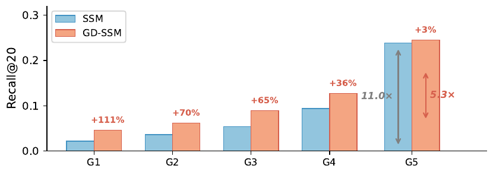

<div align="center">

# Norm Removed, Bias Remains: Gradient-Decoupled Sampled Softmax for Collaborative Filtering

**[Woo-Seong Yun](https://scholar.google.com/citations?user=ZRXyvtMAAAAJ)**<sup>\*1</sup> &nbsp;·&nbsp; **Yeo-Jun Choi**<sup>\*2</sup> &nbsp;·&nbsp; **Yoon-Sik Cho**<sup>2</sup>

<sub><sup>1</sup>WATCHA Inc. &nbsp;·&nbsp; <sup>2</sup>Department of Artificial Intelligence, Chung-Ang University</sub>

*CIKM 2026 (35th ACM International Conference on Information and Knowledge Management), Rome, Italy*

[](https://doi.org/10.1145/3799682.3840081)
[](https://pytorch.org/)
[](LICENSE)
[](https://watcha.com)

</div>

This repository accompanies our CIKM 2026 paper:

> Norm Removed, Bias Remains: Gradient-Decoupled Sampled Softmax for Collaborative Filtering (CIKM, 2026)

This work was conducted at [WATCHA](https://watcha.com), a video streaming service, in collaboration with Chung-Ang University. Beyond public benchmarks, GD-SSM is validated on WATCHA's production interaction logs.

<p align="center">
  
</p>

## Code

The code will be released after CIKM 2026.

## Overview

Sampled softmax (SSM) with cosine scoring has become the dominant objective for collaborative filtering because it normalizes embedding norms, the carrier of popularity bias, out of the score. Our gradient-level analysis shows that degree bias nonetheless re-enters through optimization: per-update norm drift recreates degree-dependent gradient magnitudes, and per-epoch gradient accumulation scales with interaction count, conflating preference with exposure. To address these two effects, we propose **GD-SSM** (Gradient-Decoupled Sampled Softmax), which applies an $L_2$ projection to user and item embeddings after every step and adds a closed-form degree prior $\psi$ that rebalances per-epoch contributions. With a single hyperparameter $\tau$, GD-SSM outperforms all baselines on three benchmarks and two backbones, by up to 33.3% overall and 114% on the least popular items.

## Citation

If you find this work useful, please cite:

```bibtex
@inproceedings{yun2026gdssm,
  title     = {Norm Removed, Bias Remains: Gradient-Decoupled Sampled Softmax for Collaborative Filtering},
  author    = {Woo-Seong Yun and Yeo-Jun Choi and Yoon-Sik Cho},
  booktitle = {Proceedings of the 35th ACM International Conference on Information and Knowledge Management},
  series    = {CIKM '26},
  year      = {2026},
  publisher = {ACM},
  note      = {to appear},
  doi       = {10.1145/3799682.3840081}
}
```

## Acknowledgements

This work was partly supported by the Institute of Information & Communications Technology Planning & Evaluation (IITP) grant funded by the Korea government (MSIT) [RS-2021-II211341, Artificial Intelligence Graduate School Program (Chung-Ang University)] and partly supported by the National Research Foundation of Korea (NRF) grant funded by the Korea government (MSIT) (No. RS-2025-00553785). Part of this work was supported by and carried out at WATCHA Inc.
